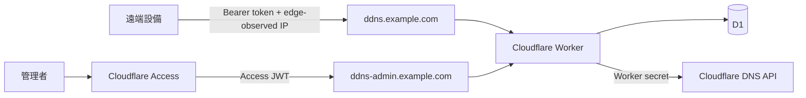

# 系統架構規格

## 邊界與信任模型

同一個 ES Module Worker 由 Host header 建立硬邊界。DDNS host 只接受 `/api/ddns/:slug`；管理 host 只提供 Vue 靜態資產與 `/api/admin/*`。未知 host fail closed。管理請求同時受 Access edge policy 與 Worker 內 RS256 JWT 驗證保護。

## 分層

- `domain`: Client、log 與錯誤等純業務模型。
- `application`: 更新與管理 use cases，協調 repository/service。
- `repositories`: persistence ports。
- `infrastructure`: D1、Cloudflare DNS、Access JWKS adapters。
- `interfaces`: HTTP router、request/response DTO。
- `middleware`: Access、rate limit、安全標頭與 body policy。
- `services` / `utils`: token、IP、redaction 等無狀態能力。

Worker 是無狀態協調層。D1 是設定、狀態與 audit 的唯一資料來源；DNS 現況以 Cloudflare API 為準。新增 Client 不需部署。

## 安全決策

1. Client 只提交 Bearer credential，來源 IP 永遠取自 Cloudflare 注入/轉送 header。
   UniFi adapter 預設啟用，將 Basic password 轉交相同 token use case；可用獨立 feature flag 關閉，且不允許 query token。
2. Token 以 32-byte CSPRNG 產生，只存 SHA-256；輪替單一 D1 update 立即取代舊 hash。
3. Client 與 record 為一對一；更新 use case 不接收任何 record/IP 欄位。
4. 原生 Rate Limiting binding 以 client id/email 分桶；其 eventual consistency 特性適合 abuse mitigation，不作計費。沒有 binding 時採 D1 固定窗口 fallback。
5. Cloudflare API adapter 只回傳正規化錯誤碼，response/log 都經 redaction。
6. Static assets 也先經 Worker host 與 Access 驗證；不讓直接 assets bypass。

## 可用性與一致性

DNS 更新成功後才更新 Client last-state 和 log。D1 狀態寫入失敗時 DNS 可能已成功（分散式系統無法原子化），記錄為可觀測性風險；下一次請求會重新讀 DNS 並自我收斂。Cloudflare API 設定 timeout，所有外部錯誤對 Client 統一為 502。
