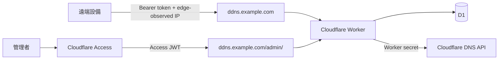

# 系統架構規格

## 邊界與信任模型

單一 ES Module Worker 由 Host 與 path 建立硬邊界。`APP_HOST` 的 `/api/ddns/:slug` 是 Client Token API；`/admin/*` 提供 Vue 管理頁與 `/admin/api/*`。裸 `/admin` 在 hostname 與 HTTPS 檢查後重新導向 `/admin/`，再由 Access edge policy 接手。其他路徑與未知 host fail closed。管理靜態資產和 API 都同時受 Access edge policy 與 Worker 內 RS256 JWT 驗證保護。

## 分層

- `domain`: Client、log 與錯誤等純業務模型。
- `application`: 更新與管理 use cases，協調 repository/service。
- `repositories`: D1 persistence 與 DNS record gateway ports；application 不依賴 Cloudflare adapter 實作。
- `infrastructure`: D1、Cloudflare DNS、Access JWKS adapters。
- `interfaces`: HTTP router、request/response DTO。
- `middleware`: Access、rate limit、安全標頭與 body policy。
- `services` / `utils`: token、IP、redaction 等無狀態能力。

Worker 是無狀態協調層。每個部署以 `DNS_ZONE_ID` 固定唯一 Cloudflare Zone，Zone Name 由 Cloudflare Zone Details API 取得；Client request 不接受 Zone 欄位。管理者可綁定既有 Record，或保存由 Worker 組合的待建立 FQDN；後者在第一次合法 DDNS 更新時以 edge-observed IP 建立，再永久保存 Cloudflare Record ID。D1 是 Client 設定、狀態與 audit 的唯一資料來源；DNS 現況以 Cloudflare API 為準。新增 Client 不需部署。

## 安全決策

1. Client 只提交 Bearer credential；非 localhost 的 HTTP 在解析 credential 前拒絕，來源 IP 永遠取自 Cloudflare 注入/轉送 header。
   UniFi adapter 預設啟用，將 Basic password 轉交相同 token use case；可用獨立 feature flag 關閉，且不允許 query token。
2. Token 以 32-byte CSPRNG 產生，只存 SHA-256；輪替單一 D1 update 立即取代舊 hash。
3. Client 與 record 為一對一；更新 use case 不接收任何 record/IP 欄位。待建立 Client 以 D1 conditional claim 序列化首次建立；中斷重試只按 D1 已固定的完整名稱與 type 恢復綁定，不採用設備 query selector。
4. 單一 D1 的固定窗口表依 key prefix 分成來源 IP pre-auth、驗證後 client id、管理者 email 三層，並持續清除過期窗口；不需要其他儲存或 Rate Limiting binding。
5. Cloudflare API adapter 只回傳正規化錯誤碼，response/log 都經 redaction。
6. Static assets 也先經 Worker host 與 Access 驗證；不讓直接 assets bypass。

## 可用性與一致性

首次更新先取得有 60 秒 stale recovery 的 D1 provisioning claim；Worker 查找 D1 目標名稱，必要時建立 Record，再以 claim token 條件式保存 Record ID。Worker 在外部建立後中斷時，下一次請求會採用唯一同名同類 Record；多筆匹配則 fail closed。一般 DNS 更新成功後才更新 Client last-state 和 log。Cloudflare DNS 結果與 D1 persistence error 分開處理：DNS 已成功時即使 D1 狀態暫時失敗仍回傳真實成功，不會誤標為 DNS failure；下一次管理查詢會直接讀 DNS 現況。管理 mutation 先寫 `started` audit，無法建立 intent 時 fail closed。Cloudflare API 設定 timeout，真正的外部錯誤對 Client 統一為 502。
